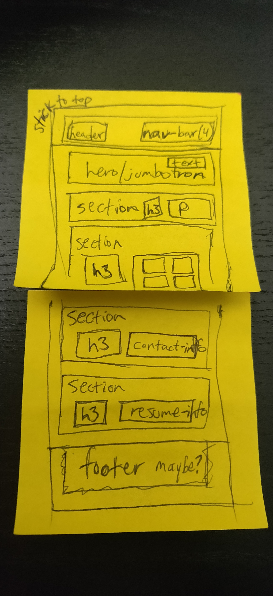
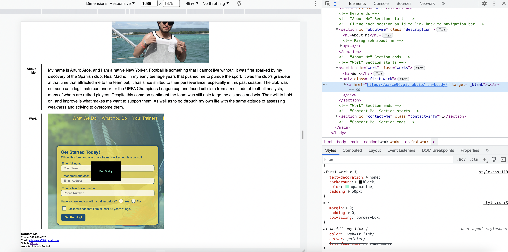
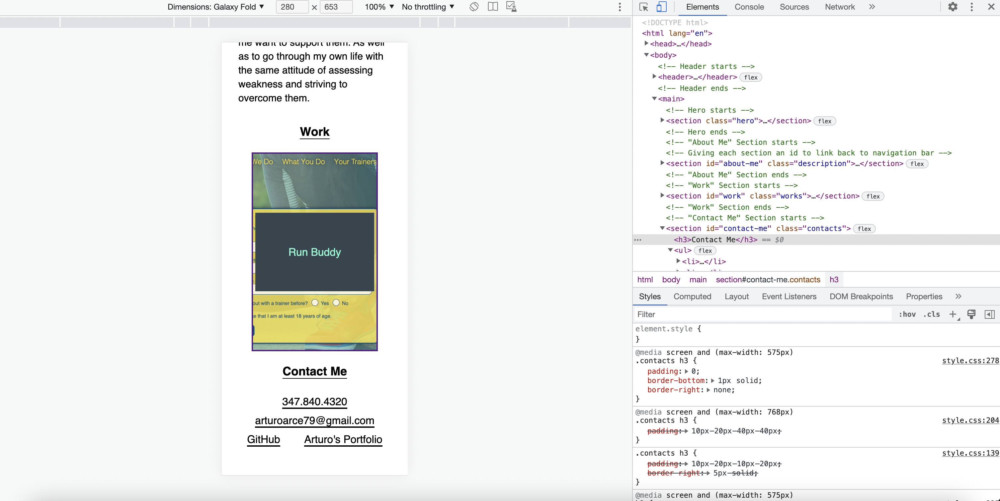

# Arturo's Portfolio 

## Purpose 
Before writing any code, I start to wireframe my portfolio. This initial process lets me visual the page. Once I finished wireframing my page, I created two files, an index.html and a style.css. In the HTML file, I wrote a header element. In this element, I have the title of my website and have my navigation bar. It is important for the navigation bar to be interactive. Therefore, I set up IDs throughout my page. This allows users to quickly jump to different sections on my site. 
 

    

 
Following this idea, I needed to showcase a work application. This work application needed a title and for the image to be interactive. I made a section where I included an anchor element and within nested a div element. 
 

    

 
Given the anchor element, I was able to make a CSS rule which allowed me to place an image as the background. I had to resize the image because it was too large. Another important thing was to make my site responsive for three different screen formats. In the stylesheet, I created media queries to aid this issue. I created one media query for smaller desktop screens. Another media query for tablet screens. Lastly, a media query for mobile screens. With these media queries in place, my site is responsive across different screen sizes.  
 

    

 
Throughout my stylesheet, I use flexbox properties to make my site more flexible. This concept greatly helped me achieve a responsive, not static, site when changing between screen sizes. Some of the flexbox properities I used were the display, flex-wrap, justify-content, align-items and flex-direction. My contact information also need to be clickable. I gave this section anchor elements to link to my phone number, email, GitHub and personal website. I could only link my email and GitHub. Lastly, I revised my code to make sure everything is where it needs to be.
 

## Website
https://aarce96.github.io/my-portfolio/ 